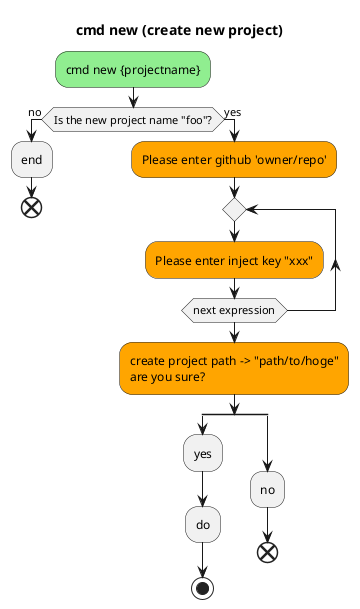

# TODO

- csss,jssの作成

# memo

## browser-sync
URI=/var/folders/gc/1js4q5b53fjblxs9z0fsj17h0000gn/T &&browser-sync start --server $URI --files $URI/strfy.html --startPath "/strfy.html"

```puml
@startuml

title cmd new (create new project)

#lightgreen:cmd new {projectname};
if (Is the new project name "foo"?) then (no)
  :end;
  end
else (yes)
#orange:Please enter github 'owner/repo';
repeat
  #orange:Please enter inject key "xxx";
repeat while (next expression)
#orange:create project path -> "path/to/hoge"\nare you sure?;
split
  :yes;
  :do;
  stop
split again
  :no;
  end


@enduml
```